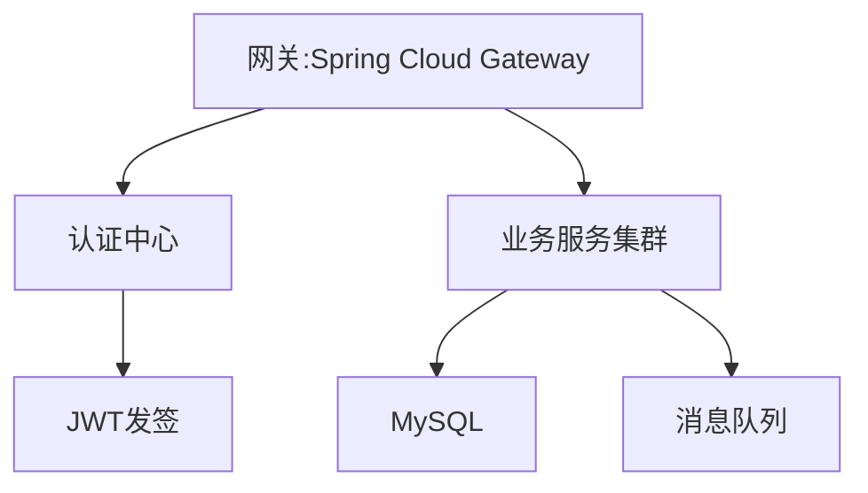
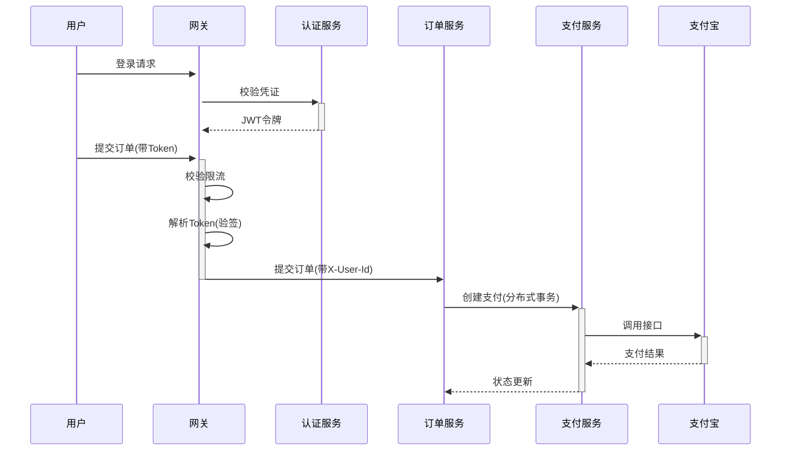
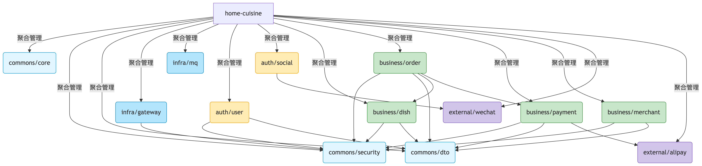
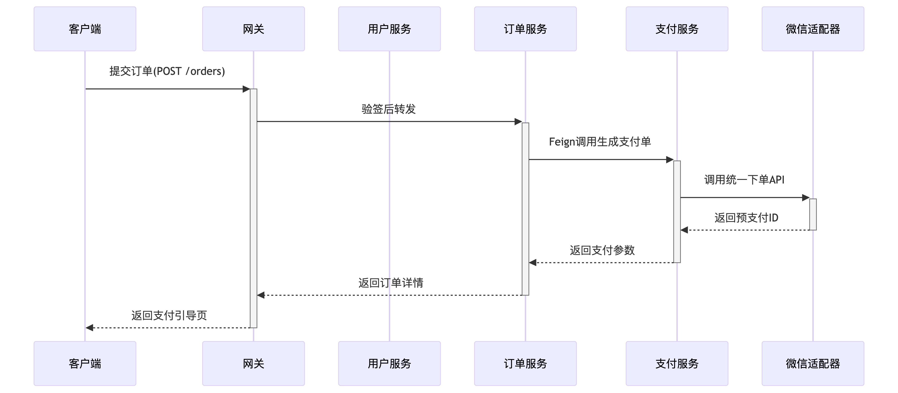
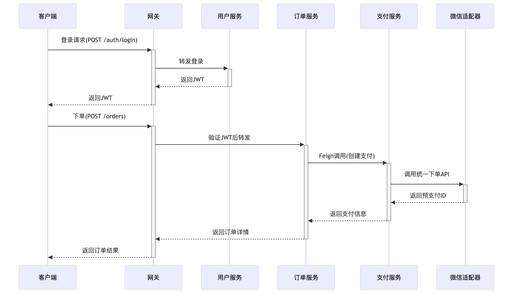
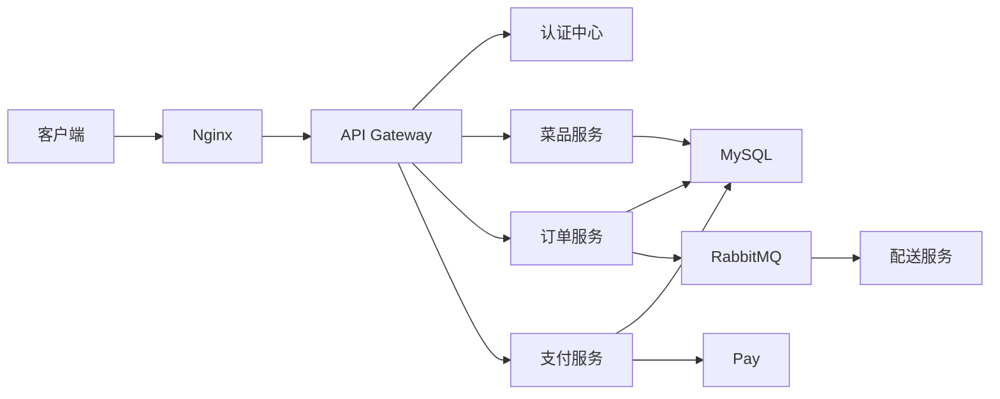

# 系统技术文档

## 一、技术架构概览
### 1.1 核心架构
- **微服务架构**：基于Spring Cloud Alibaba的分布式解决方案
- **前后端分离**：Vue前端 + Spring Boot后端API

### 1.2 技术栈矩阵
| 类别               | 技术选型                      | 版本                  | 备注                     |
|--------------------|-----------------------------|-----------------------|--------------------------|
| 基础框架           | Spring Boot                 | 2.2.2.RELEASE        |                          |
| 微服务套件         | Spring Cloud Alibaba        | 2.2.1.RELEASE        |                          |
| 服务治理           | Nacos                       | 1.2.1                | 注册中心+配置中心         |
| 容错保护           | Sentinel                    | 1.7.1                |                          |
| 分布式事务         | Seata                       | 1.2.0                |                          |
| 数据持久化         | MyBatis-Plus               | 3.4.2                |                          |

### Spring Cloud Alibaba 依赖关系
| 组件                  | 推荐版本           | 必须匹配的Spring Boot版本 | 注意事项                     |
|-----------------------|-------------------|--------------------------|----------------------------|
| Spring Cloud Alibaba  | 2.2.1.RELEASE    | 2.2.x ~ 2.3.x           | 不支持Spring Boot 2.4+      |
| Nacos Client          | 1.2.1            | 与主版本一致             | 配置中心需1.3.0+支持yaml    |
| Sentinel             | 1.7.1            | 无强制要求               | 控制台需单独部署            |
| Seata                | 1.2.0            | 建议2.2.x               | 需配合nacos-config使用      |

### 1.3 基础设施


## 二、微服务架构
### 2.1 服务划分原则
- **垂直拆分**：按业务领域划分（订单/支付/菜品）
- **水平拆分**：通用功能下沉（认证/消息）

### 2.2 服务依赖关系
```markdown
home-cuisine（聚合POM）
├── commons/          # 通用基础模块
│   ├── core          # 核心工具
│   ├── security      # 安全认证
│   └── dto           # 统一数据模型
├── infra/            # 基础设施
│   ├── gateway       # 网关服务
│   └── mq            # 消息队列
├── auth/             # 认证中心
│   ├── user          # 用户服务（登录）
│   └── social        # 社交登录（非部署服务，代码被 user 依赖）
├── business/         # 业务服务
│   ├── dish          # 菜品服务
│   ├── order         # 订单服务
│   ├── payment       # 支付服务
│   ├── merchant      # 商家后台
│   └── delivery      # 配送服务（预留）
└── external/         # 第三方对接
    ├── wechat        # 微信
    ├── alipay        # 支付宝
    └── sms           # 短信服务

```
### 关键数据流








### 2.3 关键服务说明
1. **认证中心**：
 - JWT令牌体系
 - 支持社交登录集成

2. **支付服务**：
 - 多通道支付（微信/支付宝）
 - Jeepay
 - 分布式事务补偿机制

## 三、环境要求
### 3.1 强制依赖
- JDK 1.8+
- MySQL 5.7+
- Redis 3.2+

### 3.2 可选组件
- 消息队列：RabbitMQ/Kafka（业务量>1万TPS时建议Kafka）
- 搜索引擎：ElasticSearch 7.x（需中文分词插件）


---

## 系统架构示意图
### 整体架构图



