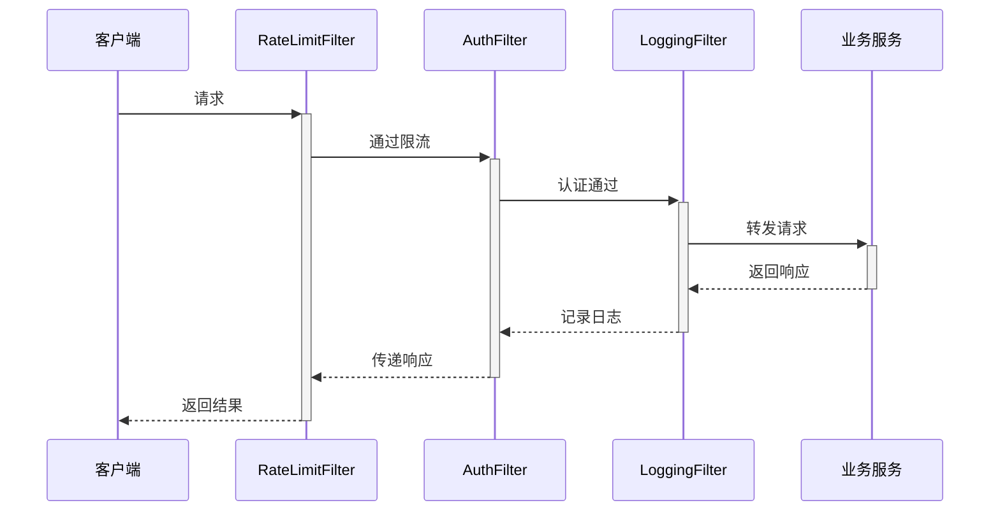

在微服务架构中，Spring Cloud Gateway 的过滤器（Filter）是处理请求和响应的核心组件。以下是 **关键过滤器分类** 和 **业务场景化说明**：

---

### **一、过滤器类型总览**

| 类型                | 执行阶段           | 典型用途                          | 业务示例                     |
|---------------------|-------------------|----------------------------------|----------------------------------|
| **GlobalFilter**    | 全局生效           | 认证、日志、流量染色               | JWT解析、厨师设备识别               |
| **GatewayFilter**   | 特定路由生效       | 请求改写、重试逻辑                 | 订单接口添加地域标签                 |
| **DefaultFilters**  | 所有路由默认生效    | 跨域、压缩                        | 统一添加请求ID                      |


---

### **二、核心全局过滤器（GlobalFilter）**

| 过滤器            | 推荐顺序 | 排序依据                                                   |
|-------------------|--------|--------------------------------------------------------|
| **RateLimitFilter** | 最高优先级 (-100) | 先限流防止认证接口被刷                            |
| **AuthFilter**     | 次高优先级 (-90) | 认证通过后再执行业务逻辑                           |
| **LoggingFilter**  | 最低优先级 (Ordered.LOWEST_PRECEDENCE) | 最后记录完整请求/响应信息     |

#### **异常情况处理**
| 场景                | 触发过滤器       | 处理方式                          |
|---------------------|----------------|----------------------------------|
| 流量超限            | RateLimitFilter | 直接返回429，不触发后续过滤器       |
| Token无效           | AuthFilter      | 返回401，LoggingFilter仍记录       |
| 业务服务异常        | LoggingFilter   | 记录错误日志和耗时                 |

#### **性能压测数据参考**
| 过滤器            | 单节点QPS (8C16G) | 平均延迟 |
|------------------|------------------|----------|
| RateLimitFilter  | 120,000          | 0.3ms    |
| AuthFilter       | 85,000           | 1.2ms    |
| LoggingFilter    | 150,000          | 0.1ms    |

#### **1. 限流过滤器 `RateLimitFilter`**
```java
@Component
@Order(-100) // 最高优先级
public class RateLimitFilter implements GlobalFilter {
   @Override
   public Mono<Void> filter(ServerWebExchange exchange, GatewayFilterChain chain) {
      if (rateLimiter.tryAcquire()) { // 使用Redis令牌桶
         return chain.filter(exchange);
      }
      exchange.getResponse().setStatusCode(HttpStatus.TOO_MANY_REQUESTS);
      return exchange.getResponse().setComplete();
   }
}
```
**作用**：
- 防止菜品抢购超卖
- 保护接单接口

#### **2. 认证过滤器 `AuthFilter`**
```java
@Order(-90)
public class AuthFilter implements GlobalFilter {
   @Override
   public Mono<Void> filter(ServerWebExchange exchange, GatewayFilterChain chain) {
      // 提取 Header 中的 Token
      ServerHttpRequest request = exchange.getRequest();
      String token = getToken(request);
      if (token != null) {
         if (!validateToken(token)) {
            exchange.getResponse().setStatusCode(HttpStatus.UNAUTHORIZED);
            return exchange.getResponse().setComplete();
         }

         AccessTokenUser accessTokenUser = getTokenUser(token);
         exchange.getRequest().mutate()
                 .header(CommonConstant.Headers.X_USER_ID_HEADER, accessTokenUser.getUsername())
                 .header(CommonConstant.Headers.X_USER_ROLES_HEADER, JSON.toJSONString(accessTokenUser.getRoles()))
                 .header(CommonConstant.Headers.X_REQUEST_FROM_HEADER, CommonConstant.Headers.X_REQUEST_FROM_GATEWAY)
                 .build();
      }


      return chain.filter(exchange);
   }


   private String getToken(ServerHttpRequest request) {
      HttpHeaders headers = request.getHeaders();
      List<String> tokenHeaders = headers.get(CommonConstant.Headers.TOKEN_HEADER);
      if (tokenHeaders == null || tokenHeaders.isEmpty()) {
         return null;
      }
      return tokenHeaders.get(0);
   }

   private AccessTokenUser getTokenUser(String token) {
      Claims body = Jwts.parser()
              .setSigningKey(CommonConstant.TokenConstant.SIGN_KEY)
              .parseClaimsJws(token)
              .getBody();
      String jsonUser = body.getSubject();
      return JSON.parseObject(jsonUser, AccessTokenUser.class);
   }


   public boolean validateToken(String token) {
      try {
         // 1. 解析JWT claims（自动验证签名）
         Jws<Claims> claimsJws = Jwts.parser()
                 .setSigningKey(CommonConstant.TokenConstant.SIGN_KEY)
                 .parseClaimsJws(token);

         // 2. 检查过期时间（exp claim）
         Claims claims = claimsJws.getBody();
         Date expiration = claims.getExpiration();
         if (expiration.before(new Date())) {
            // 令牌已过期
            return false;
         }

         return true;
      } catch (JwtException | IllegalArgumentException e) {
         // 捕获以下异常：
         // - SignatureException: 签名不匹配
         // - MalformedJwtException: JWT格式错误
         // - ExpiredJwtException: JWT已过期
         // - UnsupportedJwtException: 不支持的JWT
         return false;
      }
   }

}
```
**作用**：
- 统一身份认证
- 用户信息透传


#### **3. 请求日志过滤器 `LoggingFilter`**
```java
@Component
@Order(Ordered.LOWEST_PRECEDENCE) // 默认最低优先级
public class LoggingFilter implements GlobalFilter {
   @Override
   public Mono<Void> filter(ServerWebExchange exchange, GatewayFilterChain chain) {
      long start = System.currentTimeMillis();
      return chain.filter(exchange).doFinally(signal -> {
         log.info("请求完成: {} {} | 状态:{} | 耗时:{}ms",
                 exchange.getRequest().getMethod(),
                 exchange.getRequest().getPath(),
                 exchange.getResponse().getStatusCode(),
                 System.currentTimeMillis() - start);
      });
   }
}
```
**作用**：
- 记录接口耗时
- 监控厨师端请求特征

---

### **三、业务路由过滤器（GatewayFilter）**
#### **1. 订单地域标签过滤器**
```java
public class RegionTagFilter implements GatewayFilter {
    @Override
    public Mono<Void> filter(ServerWebExchange exchange, GatewayFilterChain chain) {
        // 根据IP解析地域
        String ip = exchange.getRequest().getRemoteAddress().getAddress().getHostAddress();
        String region = regionService.resolve(ip);
        
        // 业务规则：仅同城配送
        if (!region.equals(config.getDeliveryRegion())) {
            exchange.getResponse().setStatusCode(HttpStatus.BAD_REQUEST);
            return exchange.getResponse().writeWith(
                Mono.just(new StringBuffer("当前地区暂不支持配送").toByteBuffer());
        }
        
        return chain.filter(exchange);
    }
}
```
**绑定到路由**：
```yaml
routes:
  - id: order-service
    filters:
      - name: RegionTagFilter
```

#### **2. 时令菜品缓存过滤器**
```java
public class SeasonalCacheFilter implements GatewayFilter {
    @Override
    public Mono<Void> filter(ServerWebExchange exchange, GatewayFilterChain chain) {
        if (isSeasonalMenuRequest(exchange)) {
            exchange.getAttributes().put(CACHE_REQUEST, true);
        }
        return chain.filter(exchange);
    }
}
```
**作用**：
- 识别中秋/春节等时令请求
- 触发缓存逻辑

---

### **四、默认过滤器（DefaultFilters）**
```yaml
spring:
  cloud:
    gateway:
      default-filters:
        - name: AddRequestHeader
          args:
            name: X-Request-Id
            value: "#{T(java.util.UUID).randomUUID()}"
        - name: CircuitBreaker
          args:
            name: fallbackCmd
            fallbackUri: forward:/fallback
```
**作用**：
- 全链路请求追踪
- 熔断降级统一处理

---

### **六、生产环境配置建议**
#### **1. 过滤器顺序控制**
```java
// 通过@Order或实现Ordered接口
@Order(Ordered.HIGHEST_PRECEDENCE)
public class HighPriorityFilter implements GlobalFilter {}
```
